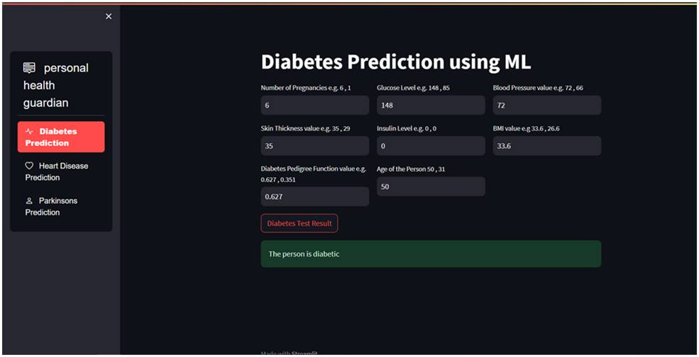
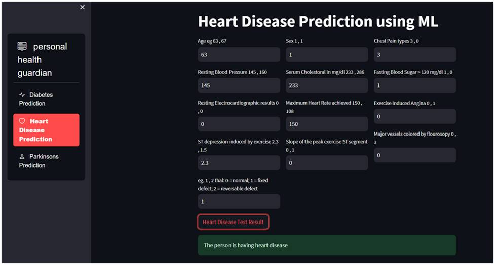
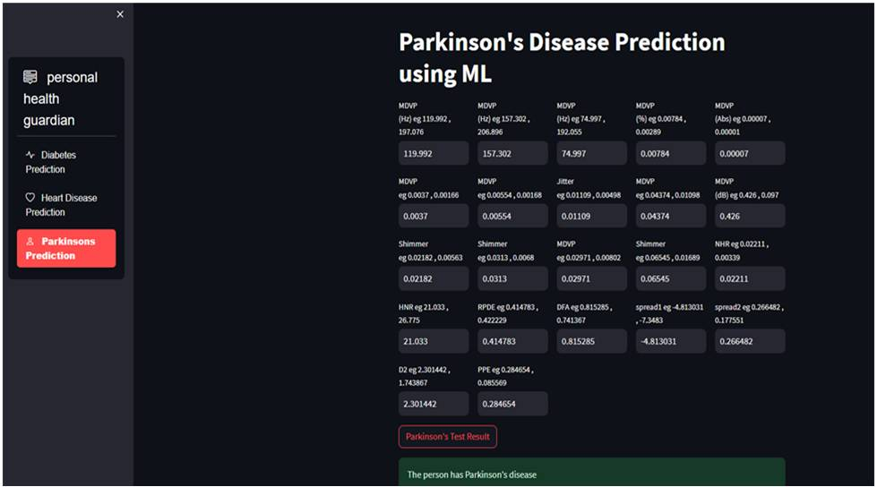

# Multiple Disease Prediction System

## Introduction

Welcome to the Multiple Disease Prediction System repository! This project aims to develop an advanced predictive system that can accurately predict the likelihood of multiple disease conditions based on various input features. The system leverages machine learning algorithms to analyze data patterns and provide valuable insights to users.

In the context of modern healthcare, early disease prediction plays a crucial role in improving patient outcomes. This project addresses the need for an automated system that can assist medical professionals in making informed decisions about disease diagnosis and treatment plans.

## Features

The Multiple Disease Prediction System offers the following features:

### 1. Data Collection and Preprocessing

- **Data Loading:** Load raw data from diverse sources and formats.
- **Data Cleaning:** Process and clean data to handle missing values and outliers.
- **Data Transformation:** Transform data into suitable formats for analysis.

### 2. Feature Extraction and Selection

- **Feature Engineering:** Create new informative features from existing ones.
- **Feature Selection:** Identify and select the most relevant features for prediction.

### 3. Model Training and Evaluation

- **Machine Learning Models:** Utilize various algorithms such as SVM, Logistic Regression, and Gradient Boosting for training.
- **Model Evaluation:** Evaluate models using metrics like accuracy, precision, recall, and F1-score.
- **Hyperparameter Tuning:** Optimize model parameters to improve performance.

### 4. Predictive System Development

- **User Interface:** Develop a user-friendly interface for interacting with the predictive system.
- **Real-time Prediction:** Provide real-time predictions based on user input data.
- **Result Visualization:** Visualize prediction results and model performance metrics.

## Technologies Used

- Python
- Scikit-learn
- Pandas
- Matplotlib
- Seaborn

## Screenshots

Diabetes Output

Heart Output

Parkinson's Output

## Getting Started

To get started with the Multiple Disease Prediction System:

1. Clone this repository using the command:

git clone https://github.com/shezi7025/Multiple-Disease-Prediction-System.git

Copy code

2. Install the required dependencies by running:

pip install -r requirements.txt

3. Follow the usage instructions provided in the repository to preprocess data, train models, and utilize the predictive system.

## Contribution Guidelines

Contributions to this project are encouraged and welcome! If you'd like to contribute:

1. Fork the repository and create a new branch for your work.
2. Implement your changes and improvements.
3. Test your changes thoroughly.
4. Create a pull request detailing the changes you've made.

Please read the [CONTRIBUTING](CONTRIBUTING.md) guidelines for more details.

## Keywords and Tags

Multiple Disease Prediction, Machine Learning, Healthcare, Data Analysis, Classification, Python

---

## Acknowledgements

We extend our gratitude to the open-source community and the developers of libraries that make this project possible.

---

Developed by Shezi (https://github.com/shezi7025)
